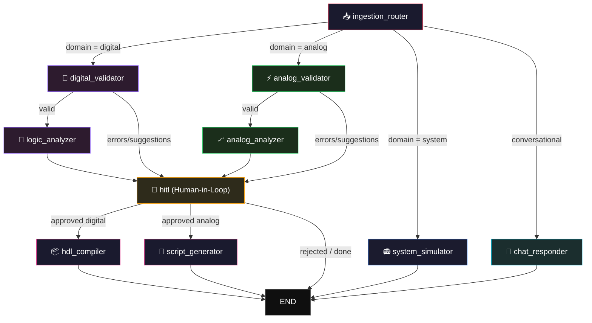

<p align="center">
  
  
  
  
  
</p>

# Electo (ECE Copilot)

**AI-native Integrated Development Environment (IDE) that designs, simulates, and optimizes hardware at the speed of thought.**

Electo is a full-stack, browser-based engineering platform that unifies digital logic, analog circuits, and signal processing on a single infinite canvas. It deploys a streaming LangGraph AI agent that reads your live schematic, identifies engineering flaws, runs rigorous mathematical simulations (without LLM hallucination), and synthesizes production-ready Verilog and MATLAB code.

---

## Table of Contents

- [Features](#features)
- [Architecture Overview](#architecture-overview)
- [LangGraph Pipeline — Deep Dive](#langgraph-pipeline--deep-dive)
  - [Analysis Graph](#analysis-graph)
  - [State Schema](#state-schema)
  - [Node Descriptions](#node-descriptions)
  - [Edge Logic & Conditional Routing](#edge-logic--conditional-routing)
- [Deterministic Math Engine](#deterministic-math-engine)
- [Tech Stack](#tech-stack)
- [Project Structure](#project-structure)
- [Getting Started](#getting-started)
  - [Prerequisites](#prerequisites)
  - [Backend Setup](#backend-setup)
  - [Frontend Setup](#frontend-setup)
- [Environment Variables](#environment-variables)
- [License](#license)

---

## Features

| Capability | Description |
|---|---|
| **Multi-Domain Canvas** | Infinite ReactFlow workspace for Digital Gates, Analog RLC, and DSP blocks |
| **Streaming AI Copilot** | Conversational LangGraph agent that reads the live netlist via Server-Sent Events (SSE) |
| **Zero-Hallucination Math** | Defers all engineering math to purely deterministic Python solver arrays |
| **Sequential Logic Engine** | Accurately simulates ripple counters with sub-cycle clock edge detection |
| **Analog MNA Solvers** | Computes DC/AC operating points and generates frequency-domain Bode Plots |
| **Human-In-The-Loop (HITL)** | Agent suggests architecture changes (e.g., pull-up resistors) requiring user approval |
| **Automated Synthesis** | Compiles verified visual schematics directly into Verilog HDL and MATLAB scripts |
| **Persistent Workspace** | Zustand + Supabase architecture ensures schemas and chat traces survive reloads |

---

## Architecture Overview

```text
┌─────────────────────────────────────────────────────────────────┐
│                        Frontend (React + Vite)                  │
│  ┌──────────┐   ┌──────────────┐   ┌──────────────────────┐    │
│  │   Chat   │   │ Canvas (IDE) │   │  Output / Timing     │    │
│  │ Copilot  │   │ (ReactFlow)  │   │  Diagram Viewer      │    │
│  └────┬─────┘   └──────┬───────┘   └──────────┬───────────┘    │
│       │                │                       │               │
│       └────────────────┼───────────────────────┘               │
│                        │  Axios + SSE (JWT Auth)               │
└────────────────────────┼───────────────────────────────────────┘
                         │
┌────────────────────────┼───────────────────────────────────────┐
│                  FastAPI Backend (Python)                       │
│                        │                                       │
│  ┌─────────────────────┼─────────────────────────────────┐     │
│  │              API Layer (REST + SSE)                    │     │
│  │       /chat/stream    /compile/hdl    /math/solve     │     │
│  └─────────────────────┬─────────────────────────────────┘     │
│                        │                                       │
│  ┌─────────────────────┼─────────────────────────────────┐     │
│  │          LangGraph Orchestration Engine                │     │
│  │                                                       │     │
│  │  ┌──────────┐    ┌────────┐┌────────┐┌─────────┐     │     │
│  │  │ Ingest   │───▶│ DigVal ││ AnaVal ││ SysSim  │     │     │
│  │  └──────────┘    └──┬─────┘└──┬─────┘└────┬────┘     │     │
│  │                     │         │           │           │     │
│  │                     ▼         ▼           ▼           │     │
│  │               ┌─────────┐┌─────────┐   [ END ]        │     │
│  │               │ DigAna  ││ AnaAna  │                  │     │
│  │               └────┬────┘└────┬────┘                  │     │
│  │                    └────┬─────┘                       │     │
│  │                         ▼                             │     │
│  │                    ┌──────────┐   SSE Suggestion      │     │
│  │                    │   HITL   │ ─────────────────▶    │     │
│  │                    └────┬─────┘                       │     │
│  │                         ▼                             │     │
│  │                    ┌──────────┐                       │     │
│  │                    │ Compiler │ → Verilog / MATLAB    │     │
│  │                    └──────────┘                       │     │
│  └───────────────────────────────────────────────────────┘     │
│                        │                                       │
│  ┌─────────────────────┼─────────────────────────────────┐     │
│  │           Deterministic Math Service Layer            │     │
│  │   netlist_eval.py │ dc_analysis.py │ filter_design.py │     │
│  └───────────────────────────────────────────────────────┘     │
└────────────────────────────────────────────────────────────────┘
```

---

## LangGraph Pipeline — Deep Dive

Electo relies on a single, highly specialized LangGraph state machine to orchestrate intent routing, validation, deterministic simulation, and user approval.

### Analysis Graph

Triggered whenever a user submits a query via the chat or clicks "Analyze" on the canvas.



### State Schema

```python
class GraphState(TypedDict):
    # Context
    session_id: str
    raw_input: str | dict           # User's chat message or run command
    netlist: dict                   # Live JSON payload from ReactFlow
    
    # Execution control
    domain: Optional[Literal["digital", "analog", "system"]]
    
    # Tracking
    validation_errors: list[str]    # Accumulates structural flaws (e.g. floating grounds)
    suggestions: list[dict]         # [{id, description, patch_payload}]
    user_approvals: list[str]       # IDs of suggestions the user clicked "Accept" on
    
    # Output
    artifacts: dict                 # Extracted arrays (hdl_code, truth_table, bode_data)
    history: list[dict]             # Full trace for SSE
```

### Node Descriptions

| Node | Agent Type | Purpose |
|---|---|---|
| `ingestion_router` | Router LLM | Determines circuit domain and decides if a full mathematical analysis is required vs a simple chat response. |
| `digital_validator` | Expert LLM | Scans JSON netlists for digital flaws (e.g., disconnected clocks, combinational loops). |
| `logic_analyzer` | Math Bridge | Passes netlist to Python `netlist_eval.py`. Interprets truth tables and timing arrays back into English for the user. |
| `analog_analyzer` | Math Bridge | Passes netlist to Python `dc_analysis.py`. Interprets MNA operating points and AC frequency responses. |
| `hitl` | Interrupt Node | Suspends the LangGraph run. Streams a diff/suggestion to the frontend. Resumes when the user clicks Accept/Reject. |
| `chat_responder` | Conversational | Simple RAG against the current netlist components. |
| `hdl_compiler` | Synthesis | Transforms verified digital netlists into structural Verilog code. |

### Edge Logic & Conditional Routing

```python
def route_after_validation(state) -> str:
    # If the validator caught unfixable errors or generated structural suggestions
    # that require user permission, bypass the heavy math solvers and go straight
    # to the Human-in-the-Loop node to ask for approval.
    if state.get("validation_errors") or state.get("suggestions"):
        return "hitl"
        
    # Otherwise, it's a clean circuit. Proceed to deterministic analysis.
    domain = state.get("domain")
    if domain == "digital":
        return "logic_analyzer"
    return "analog_analyzer"
```

---

## Deterministic Math Engine

To ensure maximum engineering accuracy, Electo completely prevents the LLM from executing arithmetic or guessing signal behavior. Instead, the `math_service` directory acts as a dedicated physics engine.

| Solver Module | Capabilities |
|---|---|
| `netlist_eval.py` | Synchronous/Asynchronous evaluation, sub-cycle clock edge detection (for ripple counters), state-machine unrolling. |
| `dc_analysis.py` | Modified Nodal Analysis (MNA), solving Kirchhoff's Current Law matrices via NumPy. |
| `truth_table.py` | Boolean expression parsing, minterm extraction. |
| `kmap_minimize.py` | Quine-McCluskey exact minimization logic. |
| `filter_design.py` | Butterworth/Chebyshev coefficient generation and FFT handling. |

---

## Tech Stack

| Layer | Technology |
|---|---|
| **LLM Inference** | Advanced Conversational Providers (Gemini / Anthropic) |
| **Orchestration** | LangGraph (StateGraph with interrupt/resume mechanics) |
| **Backend API** | FastAPI + Uvicorn |
| **Visual Canvas** | `@xyflow/react` (React Flow) |
| **State Management** | Zustand (with localStorage persistence middleware) |
| **Math Solvers** | Python (NumPy, SciPy) |
| **Database & Auth** | Supabase (PostgreSQL + JWT) |
| **Frontend UI** | React 18 + Vite + TailwindCSS + Lucide Icons |
| **Streaming** | SSE (Server-Sent Events) via Starlette |

---

## Project Structure

```text
Electo/
├── frontend/                     # React + Vite Client Application
│   ├── public/                   # Static assets (images, icons)
│   └── src/
│       ├── components/           # Reusable UI Architecture
│       │   ├── auth/             # Brand panels & login handling
│       │   ├── canvas/           # React Flow nodes (GateNode, AnalogNode, etc.)
│       │   ├── chat/             # LangGraph SSE chat interface & Suggestion Cards
│       │   ├── dashboard/        # Grid layouts & project routing
│       │   ├── outputs/          # TimingDiagramPanel, HdlCodePanel, TruthTablePanel
│       │   └── shared/           # Design System (Buttons, Spinners)
│       ├── hooks/                # Custom React Hooks
│       │   ├── useSSE.ts         # Handles graph stream consumption
│       │   ├── useAuth.ts        # Supabase session state
│       │   └── useMathApi.ts     # Direct REST triggers for solvers
│       ├── lib/                  # Utilities (Tailwind merge, styling helpers)
│       ├── pages/                # Top-level route components
│       ├── store/                # Zustand State Management
│       │   ├── canvasStore.ts    # Persisted Netlist/Canvas arrays
│       │   └── sessionStore.ts   # Persisted LangGraph chat history
│       ├── types/                # Strict TypeScript interfaces
│       ├── App.tsx               # Main application router
│       └── index.css             # Tailwind imports & global variables
│
└── backend/                      # FastAPI + LangGraph Server
    ├── auth/                     # Supabase JWT verification interceptors
    ├── graph/                    # The Agentic Brain
    │   ├── nodes/                # Individual LangGraph execution blocks
    │   │   ├── _llm.py           # Model bindings
    │   │   ├── analog_analyzer.py
    │   │   ├── chat_responder.py
    │   │   ├── digital_validator.py
    │   │   ├── hdl_compiler.py
    │   │   ├── hitl.py           # Human-in-the-loop state suspension
    │   │   └── ingestion_router.py
    │   ├── edges.py              # Conditional routing edge logic
    │   ├── graph.py              # Main StateGraph compiler topology
    │   ├── runner.py             # Asynchronous graph executor (SSE streamer)
    │   └── state.py              # TypedDict defining graph memory
    ├── math_service/             # The Deterministic Engine (Zero Hallucination)
    │   ├── ac_analysis.py        # AC nodal sweeps
    │   ├── dc_analysis.py        # DC Operating Point (MNA)
    │   ├── netlist_eval.py       # Async/Sync Sequential logic
    │   ├── truth_table.py        # Boolean Algebra
    │   ├── kmap_minimize.py      # Logic simplification
    │   ├── bode.py               # Transfer function plotting
    │   ├── fft.py                # Fast Fourier Transforms
    │   └── bom.py                # Hardware cost optimizer
    ├── main.py                   # FastAPI ASGI entry point
    └── router.py                 # API endpoints (e.g. /api/agent/stream)
```

---

## Getting Started

### Prerequisites

- **Docker & Docker Compose** (Recommended for full-stack deployment)
- **Python 3.10+ & Node.js 18+** (If running locally without Docker)
- **Supabase account** (For JWT Authentication and DB)
- **Google Gemini API Key** (For LangGraph Agents)
- **LangSmith API Key** (Optional, for observability)

### 🐳 Run with Docker (Recommended)

Electo is fully containerized. You can spin up the entire application—frontend (Nginx) and backend (FastAPI)—with a single command:

```bash
# Set up your environment variables first
cp backend/.env.example backend/.env
# Edit backend/.env with your API keys

# Build and start the containers
docker compose up --build -d
```
The application will be available at `http://localhost:5173` (or `8000` for backend).

### Running Locally (Without Docker)

#### 1. Backend Setup
```bash
cd backend
python -m venv venv
source venv/bin/activate  # or .\venv\Scripts\activate on Windows
pip install -r requirements.txt
python -m uvicorn main:app --reload --port 8000
```

#### 2. Frontend Setup
```bash
cd frontend
npm install
npm run dev
```

---

## Environment Variables

Create a `.env` file in the `backend/` directory:

```env
# Database & Auth
SUPABASE_URL=https://your-project.supabase.co
SUPABASE_SERVICE_ROLE_KEY=your_service_role_key
FRONTEND_URL=http://localhost:5173

# LLM Provider
GOOGLE_API_KEY=your_gemini_api_key

# LangSmith Observability (Optional)
LANGCHAIN_TRACING_V2=true
LANGCHAIN_ENDPOINT=https://api.smith.langchain.com
LANGCHAIN_API_KEY=your_langsmith_api_key
LANGCHAIN_PROJECT=AiECE
```

For the frontend, configure these in `docker-compose.yml` or a `frontend/.env` file:
```env
VITE_SUPABASE_URL=https://your-project.supabase.co
VITE_SUPABASE_ANON_KEY=your_anon_key
VITE_BACKEND_URL=http://localhost:8000
```

---

---

<p align="center">
  <sub>Engineered to bring the speed of software development to hardware design.</sub>
</p>
