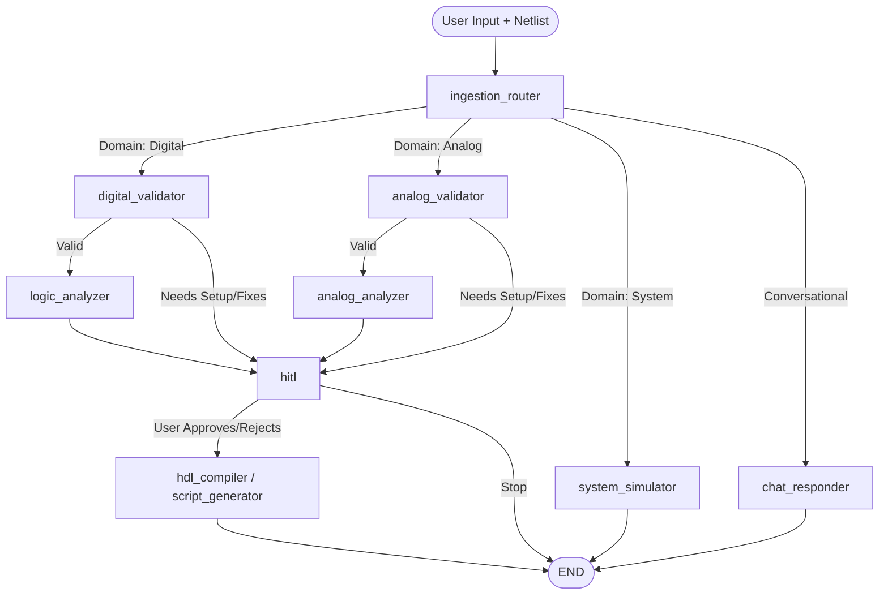

# Electo / ECE Copilot

## Overview
Electo (ECE Copilot) is a comprehensive, AI-native Integrated Development Environment (IDE) built specifically for Electrical and Computer Engineering (ECE). It enables engineers and students to design digital, analog, and signal processing systems on a unified, web-based visual canvas. 

The core of the platform is a streaming LangGraph AI Copilot that analyzes, simulates, and optimizes circuits in real-time, completely bridging the gap between schematic capture and mathematical simulation.

## Features
- **Visual Circuit Canvas:** A highly responsive drag-and-drop interface powered by ReactFlow, supporting Digital logic, Analog components, and System/DSP blocks.
- **AI Copilot (LangGraph):** A real-time conversational agent capable of modifying the canvas, detecting errors, and providing contextual engineering analysis via Server-Sent Events (SSE).
- **Deterministic Simulation Engine:** 
  - *Digital:* Truth tables, K-Map minimization, asynchronous/synchronous sequential simulation (half-cycle edge-triggered timing diagrams), and automated Verilog HDL synthesis.
  - *Analog:* DC/AC Operating Point (nodal) analysis, Bode plots, and SPICE-like simulation capabilities.
  - *Signal/Systems:* Fast Fourier Transforms (FFTs), convolution, filter design, and MATLAB/Simulink script generation.
- **Human-In-The-Loop (HITL):** The AI proposes Bill of Materials (BOM) optimizations, safety fixes (e.g., pull-up resistors), or architectural changes which the user must explicitly approve before they are applied to the canvas.

---

## System Architecture

### Frontend
- **Framework:** React + Vite + TailwindCSS
- **State Management:** Zustand (utilizing `persist` middleware for deep session and canvas persistence across reloads)
- **Interactive Canvas:** `@xyflow/react` (React Flow)
- **Auth & Database:** Supabase (for user authentication and project persistence)

### Backend (LangGraph Pipeline)
- **Framework:** FastAPI
- **Agent Orchestration:** LangGraph (StateGraph)
- **LLM Integration:** Advanced LLM providers for conversational routing, insight generation, and code synthesis.
- **Math Service:** Deterministic Python solvers for guaranteed engineering accuracy (ensuring the LLM never hallucinates mathematical outputs).

---

## LangGraph Pipeline Structure

The backend orchestrates intelligence through a directed acyclic state graph (LangGraph). When a user submits a query or requests an analysis, the state is passed through the following pipeline:



### Core Pipeline Nodes
1. **`ingestion_router`**: The entry point. Extracts the domain, parses user intent, and determines whether the user wants a simple chat response or a full mathematical simulation pipeline.
2. **`digital_validator` / `analog_validator`**: Scans the current netlist graph for common engineering errors (e.g., floating inputs, missing grounds, short circuits). If errors are fixable, it generates a list of suggestions and routes directly to the HITL node.
3. **`logic_analyzer` / `analog_analyzer`**: Interfaces with the deterministic math solvers (e.g., truth table generator, DC matrix solver). Passes the calculated data back to the LLM to generate human-readable insights (e.g., "This topology acts as an active high-pass filter").
4. **`system_simulator`**: Directly simulates DSP and communication systems blocks.
5. **`chat_responder`**: Provides immediate conversational answers using the active netlist as context without running heavy simulations.
6. **`hitl` (Human-in-the-Loop)**: Pauses graph execution. Yields a structured suggestion (e.g., "Add 10k pull-up resistor to pin 4") to the frontend via SSE. Waits for the user to click "Accept" or "Reject" before applying the patch to the netlist state.
7. **`hdl_compiler` / `script_generator`**: After approvals or final analysis, synthesizes deployable engineering code (Verilog HDL or MATLAB scripts) based on the refined netlist.

---

## Math & Simulation Engine (`math_service/`)

To ensure high fidelity, the AI does *not* guess mathematical behavior. Instead, the backend relies on a suite of purely deterministic Python modules:
- **`netlist_eval.py`**: Robust sequential and combinational logic simulation. Supports sub-cycle edge detection for accurate asynchronous ripple counters, plus sequential Verilog generation.
- **`truth_table.py` & `kmap_minimize.py`**: Boolean algebra simplifications and Quine-McCluskey minimizations.
- **`dc_analysis.py` & `ac_analysis.py`**: Modified Nodal Analysis (MNA) for evaluating analog circuits.
- **`bode.py`**: Frequency response and transfer function plotting.
- **`fft.py` & `filter_design.py`**: Digital Signal Processing (DSP) analysis toolkit.
- **`bom.py`**: Cost and component optimization for hardware deployment.

---

## Local Development

### 1. Start the Backend
The backend runs on FastAPI and uses Uvicorn for local hosting.
```bash
cd backend
python -m venv venv
source venv/bin/activate  # Or `venv\Scripts\activate` on Windows
pip install -r requirements.txt
python -m uvicorn main:app --reload --port 8000
```

### 2. Start the Frontend
The frontend uses Vite for blazing-fast HMR.
```bash
cd frontend
npm install
npm run dev
```
The app will be available at `http://localhost:5173`.
